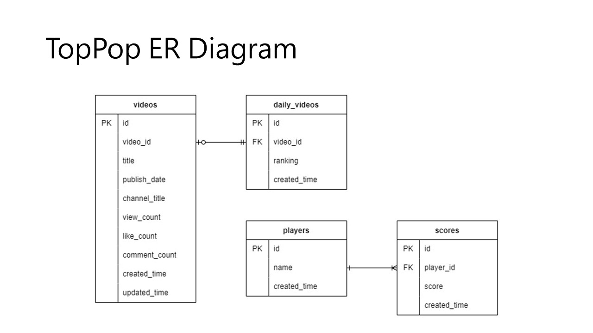

# TopPop API Client

## Overview

TopPop is a music video sorting game. To win this game, the players have to accurately sort a number of *top pop*ular music videos in order of their popularity.

This repo includes the TopPop API Client and a demo web application.

## Instructions

### 1. Install & setup

Clone the repo:
```bash
git clone https://github.com/PigeonBiz/TopPop_API
cd TopPop_API
```
Install all gems in Gemfile:
```bash
bundle install
```

### 2. Create an Access Token

Follow [this instruction](https://developers.google.com/youtube/v3/getting-started) to create a Youtube API access token.

Create `config/secrets.yml` file:
```bash
rake setup
```

Insert your access token to `secrets.yml`:
```yml
---
development:
  DB_FILENAME: db/local/dev.db
  ACCESS_TOKEN: <your_token_here>

test:
  DB_FILENAME: db/local/test.db
  ACCESS_TOKEN: <your_token_here>

production:
  ACCESS_TOKEN: <your_token_here>
```


### 3. Launch the web app

<!-- Run:
```bash
rake run
``` -->

Run puma with your RACK_ENV (like `RACK_ENV=test puma`). Please don't run `rake run` we haven't fix the problem with this command.

You should see the web app in port 9292 `http://localhost:9292/`.


## Database
1. ER Diagram
   
2. Videos
  - Has following columns
    - id
      - PK
    - video_id
      - uniqu
      - not null
    - title
    - publish_date
    - channel_title
    - view_count
      - not null
    - like_count
    - comment_count
    - created_time
    - updated_time
3. daily_videos
  - Has following columns
    - id
      - PK
    - video_id
      - FK
      - not null
    - ranking
      - not null
    - created_time
4. Players
  - Has following columns
    - id
      - PK
    - name
      - uniqu
      - not null
    - created_time
    - updated_time
5. Scores
  - Has following columns
    - id
      - PK
    - player_id
      - FK
      - not null
    - score
      - not null
    - created_time


## Branches

There are several branches with specific purposes on this repo:

- The `api_explore` branch serves the purpose of exploring Youtube API with a script called `project_info.rb`.

- The `api_library` branch has the `project_info.rb` made into a library.

- The `test_vcr` branch adds stubbing web calls (the vcr gem) and automated testing tools to the `api_library` branch.

- The `data-mapper` branch applies Enterprise Design Patterns.

- The `mvc` branch evolves with a web app following the Model-View-Controller (MVC) application architecture.

- The `database` branch evolves with database service.