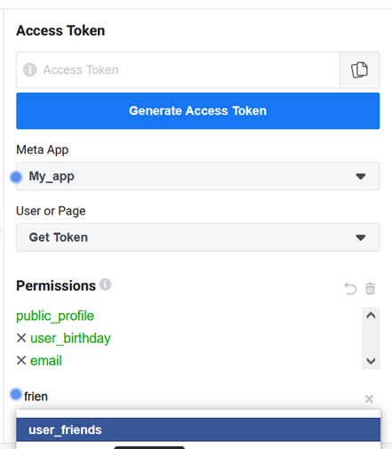

# NTHU_SOA_API_Client


## Overview

A project to explore Facebook Graph API by gathering one's own personal data, created to fulfill the requirements of the course Service Oriented Architecture (SOA), NTHU.


## Instruction

### 1. Install NTHU_SOA_API_Client

Clone the NTHU_SOA_API_Client repo:
```bash
git clone https://github.com/PigeonBiz/NTHU_SOA_API_Client
cd NTHU_SOA_API_Client
```
Install all gems in Gemfile:
```bash
bundle install
```
Create the hidden files:
```bash
mkdir config
cd config
touch secrets.yml
cd ..
mkdir -p spec/fixtures
cd spec/fixtures
touch fb_results.yml
```


### 2. Create ACCESS_TOKEN 

Log in [Facebook](https://www.facebook.com/) OR if you haven't got an account, sign up for one.

Log in [Meta for Developers](https://developers.facebook.com/apps/)
OR if you haven't got an account, follow [this instruction](https://developers.facebook.com/docs/development/register) to register as a Facebook Developer.

Inside Meta for Developers, [create a new app](https://developers.facebook.com/apps/create/). Please select type None for the app.

Inside your app, on the title bar, go to Tool > [Graph API Explorer](https://developers.facebook.com/tools/explorer/).

In the Permissions section at the tool bar on your right, type in "email", "user_birthday", "user_friends".



Click Generate Access Token, log in Facebook to give access to your app. Copy your token.


### 3. Query your personal data

Inside `config/secrets.yml`, insert your Access Token in this format:
```yml
---
  ACCESS_TOKEN: EAAIiF9kWqh...
```
Go to `lib/` and run:
```bash
ruby project_info.rb
``` 
You should see the result in `spec/fixtures/fb_results.yml` in this format:
```yml
---
name: Your_facebook_name
birthday: 01/01/2001
email: example@gmail.com
friends_total_count: 1337
```